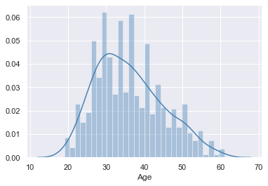
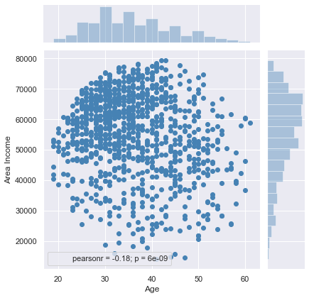
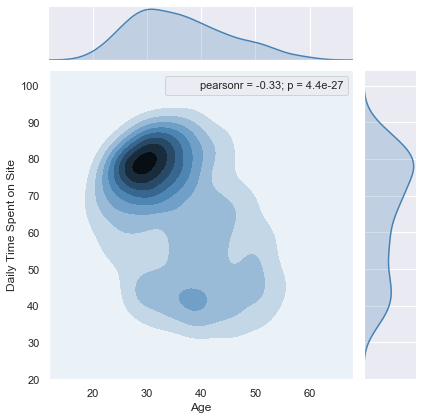
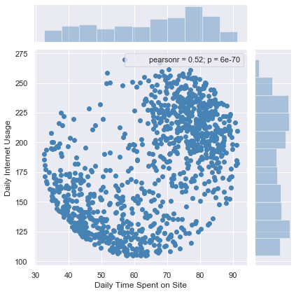
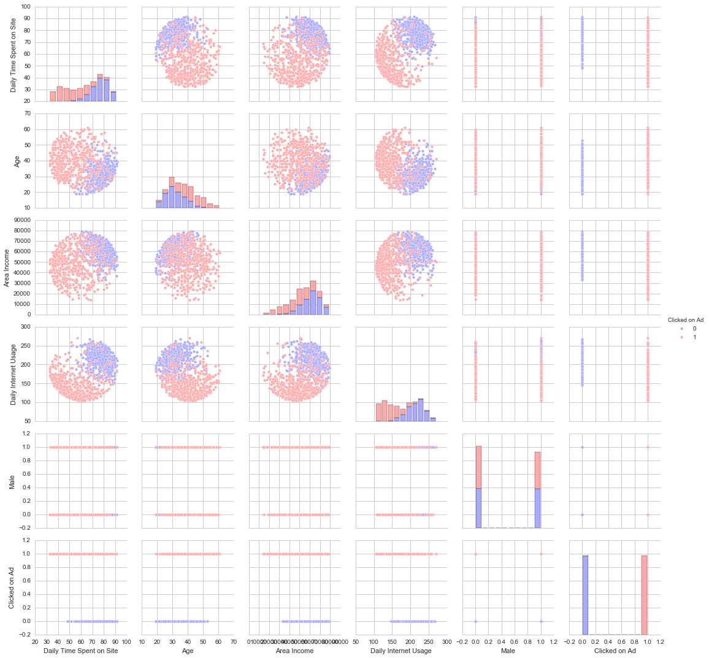

# Logistic Regression Project 


In this project I will be working with a fake advertising data set, indicating whether or not a particular internet user clicked on an Advertisement. We will try to create a model that will predict whether or not they will click on an ad based off the features of that user.<br>
**Data source: Purwadhika School**

## Import Libraries
Import the necessary libraries. 


```python
import pandas as pd
import numpy as np
import matplotlib.pyplot as plt
import seaborn as sns
%matplotlib inline
from scipy.stats import pearsonr
```

## Get the Data
I will work with the advertising csv file from the client, and put it to the dataframe called ad_data.
This data set contains the following features:

* 'Daily Time Spent on Site': consumer time on site in minutes
* 'Age': cutomer age in years
* 'Area Income': Avg. Income of geographical area of consumer
* 'Daily Internet Usage': Avg. minutes a day consumer is on the internet
* 'Ad Topic Line': Headline of the advertisement
* 'City': City of consumer
* 'Male': Whether or not consumer was male
* 'Country': Country of consumer
* 'Timestamp': Time at which consumer clicked on Ad or closed window
* 'Clicked on Ad': 0 or 1 indicated clicking on Ad


```python
ad_data = pd.read_csv('advertising.csv')
```

**Check the head of ad_data**


```python
ad_data.head()
```


<div>
<style scoped>
    .dataframe tbody tr th:only-of-type {
        vertical-align: middle;
    }

    .dataframe tbody tr th {
        vertical-align: top;
    }

    .dataframe thead th {
        text-align: right;
    }
</style>
<table border="1" class="dataframe">
  <thead>
    <tr style="text-align: right;">
      <th></th>
      <th>Daily Time Spent on Site</th>
      <th>Age</th>
      <th>Area Income</th>
      <th>Daily Internet Usage</th>
      <th>Ad Topic Line</th>
      <th>City</th>
      <th>Male</th>
      <th>Country</th>
      <th>Timestamp</th>
      <th>Clicked on Ad</th>
    </tr>
  </thead>
  <tbody>
    <tr>
      <td>0</td>
      <td>68.95</td>
      <td>35</td>
      <td>61833.90</td>
      <td>256.09</td>
      <td>Cloned 5thgeneration orchestration</td>
      <td>Wrightburgh</td>
      <td>0</td>
      <td>Tunisia</td>
      <td>2016-03-27 00:53:11</td>
      <td>0</td>
    </tr>
    <tr>
      <td>1</td>
      <td>80.23</td>
      <td>31</td>
      <td>68441.85</td>
      <td>193.77</td>
      <td>Monitored national standardization</td>
      <td>West Jodi</td>
      <td>1</td>
      <td>Nauru</td>
      <td>2016-04-04 01:39:02</td>
      <td>0</td>
    </tr>
    <tr>
      <td>2</td>
      <td>69.47</td>
      <td>26</td>
      <td>59785.94</td>
      <td>236.50</td>
      <td>Organic bottom-line service-desk</td>
      <td>Davidton</td>
      <td>0</td>
      <td>San Marino</td>
      <td>2016-03-13 20:35:42</td>
      <td>0</td>
    </tr>
    <tr>
      <td>3</td>
      <td>74.15</td>
      <td>29</td>
      <td>54806.18</td>
      <td>245.89</td>
      <td>Triple-buffered reciprocal time-frame</td>
      <td>West Terrifurt</td>
      <td>1</td>
      <td>Italy</td>
      <td>2016-01-10 02:31:19</td>
      <td>0</td>
    </tr>
    <tr>
      <td>4</td>
      <td>68.37</td>
      <td>35</td>
      <td>73889.99</td>
      <td>225.58</td>
      <td>Robust logistical utilization</td>
      <td>South Manuel</td>
      <td>0</td>
      <td>Iceland</td>
      <td>2016-06-03 03:36:18</td>
      <td>0</td>
    </tr>
  </tbody>
</table>
</div>


**Use info and describe() on ad_data**


```python
df.info()
```

    <class 'pandas.core.frame.DataFrame'>
    RangeIndex: 1000 entries, 0 to 999
    Data columns (total 10 columns):
    Daily Time Spent on Site    1000 non-null float64
    Age                         1000 non-null int64
    Area Income                 1000 non-null float64
    Daily Internet Usage        1000 non-null float64
    Ad Topic Line               1000 non-null object
    City                        1000 non-null object
    Male                        1000 non-null int64
    Country                     1000 non-null object
    Timestamp                   1000 non-null object
    Clicked on Ad               1000 non-null int64
    dtypes: float64(3), int64(3), object(4)
    memory usage: 78.2+ KB


```python
df.describe()
```


<div>
<style scoped>
    .dataframe tbody tr th:only-of-type {
        vertical-align: middle;
    }

    .dataframe tbody tr th {
        vertical-align: top;
    }

    .dataframe thead th {
        text-align: right;
    }
</style>
<table border="1" class="dataframe">
  <thead>
    <tr style="text-align: right;">
      <th></th>
      <th>Daily Time Spent on Site</th>
      <th>Age</th>
      <th>Area Income</th>
      <th>Daily Internet Usage</th>
      <th>Male</th>
      <th>Clicked on Ad</th>
    </tr>
  </thead>
  <tbody>
    <tr>
      <td>count</td>
      <td>1000.000000</td>
      <td>1000.000000</td>
      <td>1000.000000</td>
      <td>1000.000000</td>
      <td>1000.000000</td>
      <td>1000.00000</td>
    </tr>
    <tr>
      <td>mean</td>
      <td>65.000200</td>
      <td>36.009000</td>
      <td>55000.000080</td>
      <td>180.000100</td>
      <td>0.481000</td>
      <td>0.50000</td>
    </tr>
    <tr>
      <td>std</td>
      <td>15.853615</td>
      <td>8.785562</td>
      <td>13414.634022</td>
      <td>43.902339</td>
      <td>0.499889</td>
      <td>0.50025</td>
    </tr>
    <tr>
      <td>min</td>
      <td>32.600000</td>
      <td>19.000000</td>
      <td>13996.500000</td>
      <td>104.780000</td>
      <td>0.000000</td>
      <td>0.00000</td>
    </tr>
    <tr>
      <td>25%</td>
      <td>51.360000</td>
      <td>29.000000</td>
      <td>47031.802500</td>
      <td>138.830000</td>
      <td>0.000000</td>
      <td>0.00000</td>
    </tr>
    <tr>
      <td>50%</td>
      <td>68.215000</td>
      <td>35.000000</td>
      <td>57012.300000</td>
      <td>183.130000</td>
      <td>0.000000</td>
      <td>0.50000</td>
    </tr>
    <tr>
      <td>75%</td>
      <td>78.547500</td>
      <td>42.000000</td>
      <td>65470.635000</td>
      <td>218.792500</td>
      <td>1.000000</td>
      <td>1.00000</td>
    </tr>
    <tr>
      <td>max</td>
      <td>91.430000</td>
      <td>61.000000</td>
      <td>79484.800000</td>
      <td>269.960000</td>
      <td>1.000000</td>
      <td>1.00000</td>
    </tr>
  </tbody>
</table>
</div>


**This dataset is clean, so we can continue to EDA.**

## Exploratory Data Analysis

Let's explore the data!


```python
from scipy.stats import pearsonr #I use this additional libraries to show the correlation value on the plot.
sns.set(style="darkgrid", color_codes=True)
```


```python
sns.distplot(ad_data['Age'], kde=True, bins=30, color='steelblue')
```


    <matplotlib.axes._subplots.AxesSubplot at 0x12694a0d0>





**I create a seaborn distplot of the <font color="royalblue">Age</font> column to see the distribution of customer's age.** <br> 
We can see that the most of customer is on 30 years age.


```python
sns.jointplot(x='Age',y='Area Income',data=ad_data, color='steelblue').annotate(pearsonr)
```

    /opt/anaconda3/lib/python3.7/site-packages/seaborn/axisgrid.py:1847: UserWarning: JointGrid annotation is deprecated and will be removed in a future release.
      warnings.warn(UserWarning(msg))


    <seaborn.axisgrid.JointGrid at 0x127054850>





**I create a jointplot to show the relation between <font color="royalblue">Area Income</font> and <font color="royalblue">Age</font>.** <br> It seems that these two features has no a good correlation.


```python
sns.jointplot(x='Age',y='Daily Time Spent on Site',data=ad_data, kind='kde', color='steelblue').annotate(pearsonr)
```


    <seaborn.axisgrid.JointGrid at 0x12af74550>





**Then I create a jointplot to show the KDE distributions of <font color="royalblue">Daily Time spent on site </font> vs. <font color="royalblue">Age</font>.** <br>
Based on this plot, we can see that the majority customers spends about 80 minutes App per day.


```python
sns.jointplot(x='Daily Time Spent on Site',y='Daily Internet Usage',data=ad_data, color='steelblue').annotate(pearsonr)
```


    <seaborn.axisgrid.JointGrid at 0x12b24d650>





**I create a jointplot of <font color="royalblue">Daily Time spent on site</font> vs. <font color="royalblue">Daily Internet Usage</font>**


```python
# sns.pairplot(ad_data, diag_kind = "kde", hue='Clicked on Ad')
```


```python

```


    <seaborn.axisgrid.PairGrid at 0x12a97fdd8>





**Finally, I create a pairplot with the hue defined by the <font color="royalblue">Clicked on Ad</font> column feature.**

> **

## Training and Testing Data

Now that I've explored the data a bit, I need to to make a prediction to find out whether or not they will click on an ad. Let's start with split the data into training and testing sets.<br>


```python
from sklearn.model_selection import train_test_split
```

**I set a variable "X" equal to the numerical features of the customers and a variable "Y" equal to the Clicked on Ad column.**


```python
X= df.select_dtypes(exclude='object').drop('Clicked on Ad', axis=1)
Y =df['Clicked on Ad']
```

**I use model_selection.train_test_split from sklearn library to split the data into training and testing sets.<br>
I set test_size=0.3 and random_state=101. It means I split the existing dataset into 70% for data training, and 30% for data test**


```python
X_train, X_test, Y_train, Y_test = train_test_split(X, Y, test_size=0.3, random_state=101)
```


```python
Y.value_counts() #case balance problem, orang yg ngeklik dan tidak sama jumlahnya
```


    1    500
    0    500
    Name: Clicked on Ad, dtype: int64


## Training the Model
Now it's time to train our model on our training data!<br>

**I need to import LogisticRegression from sklearn.linear_model library.**


```python
from sklearn.linear_model import LogisticRegression
```

**Then, create an instance of a LogisticRegression() model named lm.**


```python
lm = LogisticRegression()
```

**Train/fit lm on the training data.**


```python
lm.fit(X_train,Y_train)
```

    /opt/anaconda3/lib/python3.7/site-packages/sklearn/linear_model/logistic.py:432: FutureWarning: Default solver will be changed to 'lbfgs' in 0.22. Specify a solver to silence this warning.
      FutureWarning)


    LogisticRegression(C=1.0, class_weight=None, dual=False, fit_intercept=True,
                       intercept_scaling=1, l1_ratio=None, max_iter=100,
                       multi_class='warn', n_jobs=None, penalty='l2',
                       random_state=None, solver='warn', tol=0.0001, verbose=0,
                       warm_start=False)


## Predictions and Evaluations
**Now predict values for the testing data.**


```python
predictions = lm.predict(X_test)
```

**To see the precision and recall value of the prediction, I create a classification report for the model using the sklearn.metrics library..**


```python
from sklearn.metrics import classification_report
```


```python
print(classification_report(Y_test,predictions))
```

                  precision    recall  f1-score   support
    
               0       0.91      0.95      0.93       157
               1       0.94      0.90      0.92       143
    
        accuracy                           0.92       300
       macro avg       0.92      0.92      0.92       300
    weighted avg       0.92      0.92      0.92       300
    


**At this part, we've already done to make the prediction. But, let's try to count the probability of the ads will be clicked or not.**


```python
predictions_proba = lm.predict_proba(X_test)
```


```python
clicked_proba = predictions_proba[:,1]
```


```python
tmp['proba'] = clicked_proba
```


```python
threshold = 0.5 
tmp['pred_0.5'] = tmp['proba'].apply(lambda x: 1 if x >= threshold else 0 )
```

**Let's count the differences result between the true value and the predictions with the variant threshold.**


```python
tmp[tmp.Y_test != tmp['pred_0.1']].shape 
```


    (63, 9)


```python
tmp[tmp.Y_test != tmp['pred_0.2']].shape
```


    (31, 9)


```python
tmp[tmp.Y_test != tmp['pred_0.3']].shape
```


    (24, 10)


```python
tmp[tmp.Y_test != tmp['pred_0.4']].shape
```


    (21, 11)


```python
tmp[tmp.Y_test != tmp['pred_0.5']].shape
```


    (23, 12)


**We can see that using threshold 0.4 give us less wrong predictions. It means this rhreshold has better accuracy.**


```python
tmp
```


<div>
<style scoped>
    .dataframe tbody tr th:only-of-type {
        vertical-align: middle;
    }

    .dataframe tbody tr th {
        vertical-align: top;
    }

    .dataframe thead th {
        text-align: right;
    }
</style>
<table border="1" class="dataframe">
  <thead>
    <tr style="text-align: right;">
      <th></th>
      <th>Daily Time Spent on Site</th>
      <th>Age</th>
      <th>Area Income</th>
      <th>Daily Internet Usage</th>
      <th>Male</th>
      <th>Y_test</th>
      <th>proba</th>
      <th>pred_0.1</th>
      <th>pred_0.2</th>
    </tr>
  </thead>
  <tbody>
    <tr>
      <td>545</td>
      <td>42.60</td>
      <td>55</td>
      <td>55121.65</td>
      <td>168.29</td>
      <td>0</td>
      <td>1</td>
      <td>0.996206</td>
      <td>1</td>
      <td>1</td>
    </tr>
    <tr>
      <td>298</td>
      <td>80.39</td>
      <td>31</td>
      <td>66269.49</td>
      <td>214.74</td>
      <td>0</td>
      <td>0</td>
      <td>0.070450</td>
      <td>0</td>
      <td>0</td>
    </tr>
    <tr>
      <td>109</td>
      <td>74.02</td>
      <td>32</td>
      <td>72272.90</td>
      <td>210.54</td>
      <td>0</td>
      <td>0</td>
      <td>0.117092</td>
      <td>1</td>
      <td>0</td>
    </tr>
    <tr>
      <td>837</td>
      <td>55.77</td>
      <td>49</td>
      <td>55942.04</td>
      <td>117.33</td>
      <td>1</td>
      <td>1</td>
      <td>0.992738</td>
      <td>1</td>
      <td>1</td>
    </tr>
    <tr>
      <td>194</td>
      <td>77.20</td>
      <td>33</td>
      <td>49325.48</td>
      <td>254.05</td>
      <td>1</td>
      <td>0</td>
      <td>0.055492</td>
      <td>0</td>
      <td>0</td>
    </tr>
    <tr>
      <td>...</td>
      <td>...</td>
      <td>...</td>
      <td>...</td>
      <td>...</td>
      <td>...</td>
      <td>...</td>
      <td>...</td>
      <td>...</td>
      <td>...</td>
    </tr>
    <tr>
      <td>847</td>
      <td>88.82</td>
      <td>36</td>
      <td>58638.75</td>
      <td>169.10</td>
      <td>0</td>
      <td>0</td>
      <td>0.334910</td>
      <td>1</td>
      <td>1</td>
    </tr>
    <tr>
      <td>682</td>
      <td>43.57</td>
      <td>36</td>
      <td>50971.73</td>
      <td>125.20</td>
      <td>1</td>
      <td>1</td>
      <td>0.921842</td>
      <td>1</td>
      <td>1</td>
    </tr>
    <tr>
      <td>884</td>
      <td>70.92</td>
      <td>39</td>
      <td>66522.79</td>
      <td>249.81</td>
      <td>1</td>
      <td>0</td>
      <td>0.218999</td>
      <td>1</td>
      <td>1</td>
    </tr>
    <tr>
      <td>325</td>
      <td>36.87</td>
      <td>36</td>
      <td>29398.61</td>
      <td>195.91</td>
      <td>0</td>
      <td>1</td>
      <td>0.767757</td>
      <td>1</td>
      <td>1</td>
    </tr>
    <tr>
      <td>482</td>
      <td>69.42</td>
      <td>25</td>
      <td>65791.17</td>
      <td>213.38</td>
      <td>0</td>
      <td>0</td>
      <td>0.033440</td>
      <td>0</td>
      <td>0</td>
    </tr>
  </tbody>
</table>
<p>300 rows × 9 columns</p>
</div>


## Thank You

See you in another Data Exploration.

**BR,<br>
Erwindra Rusli<br>
Data Scientist Student in Purwadhika School**


```python

```
